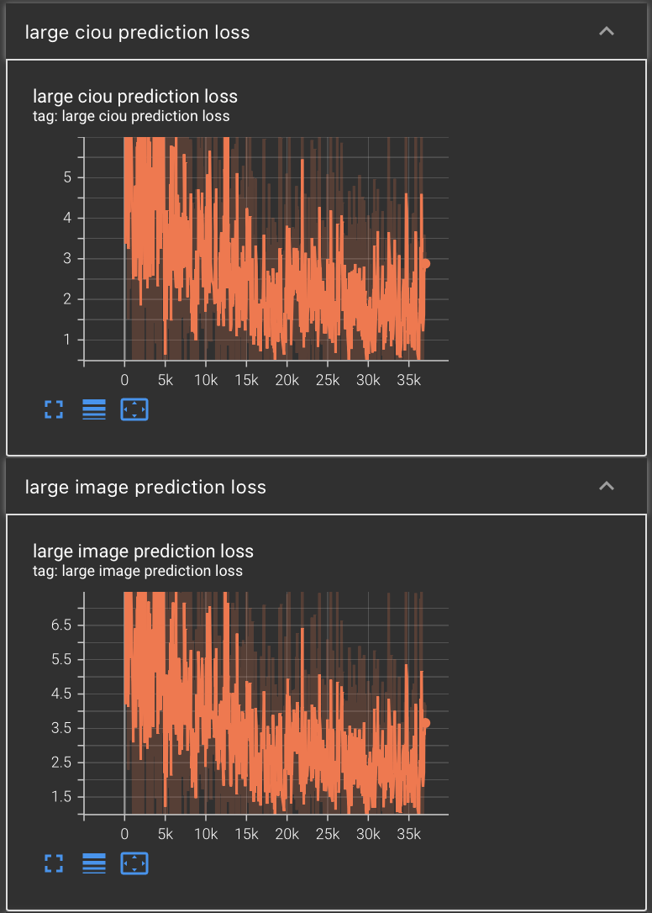
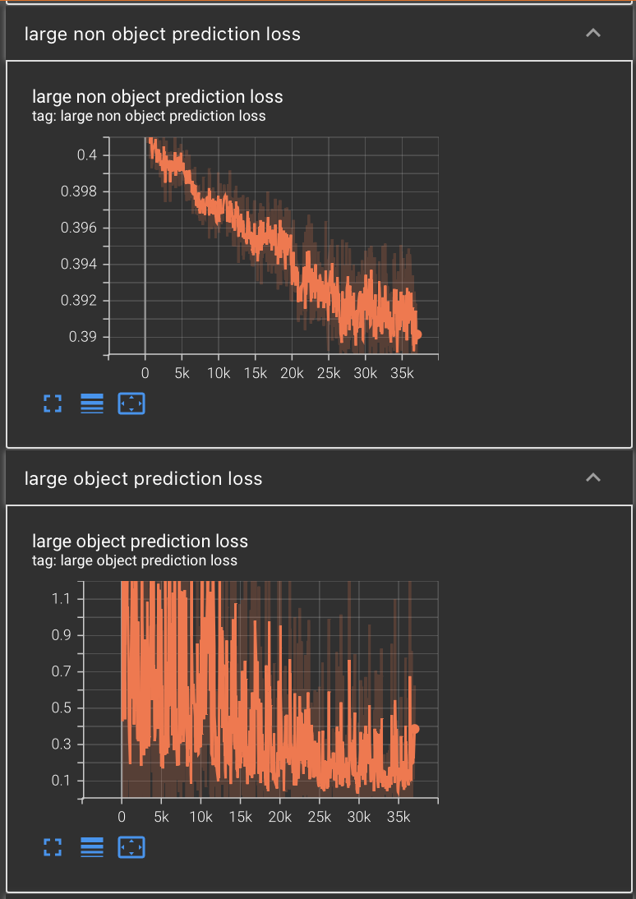
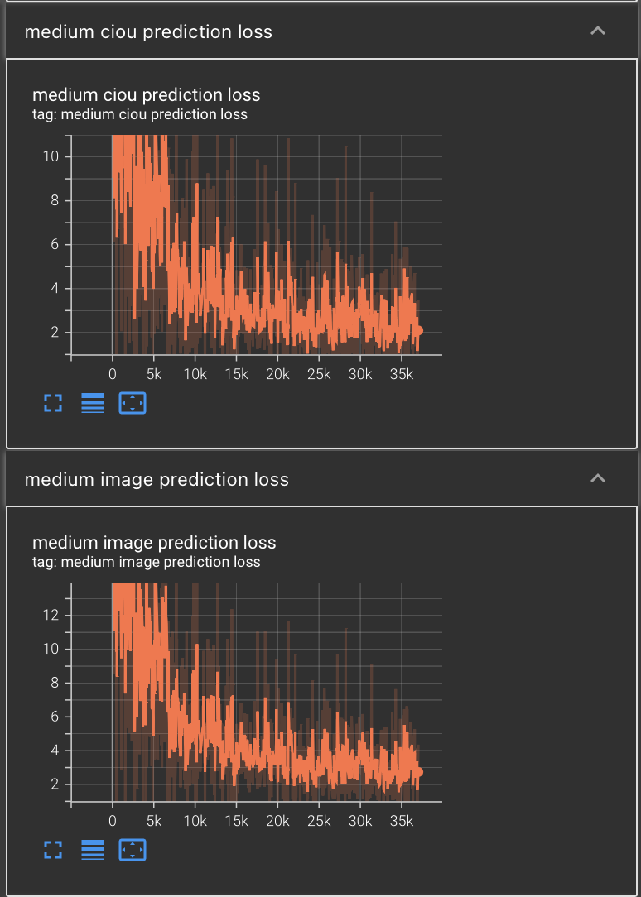
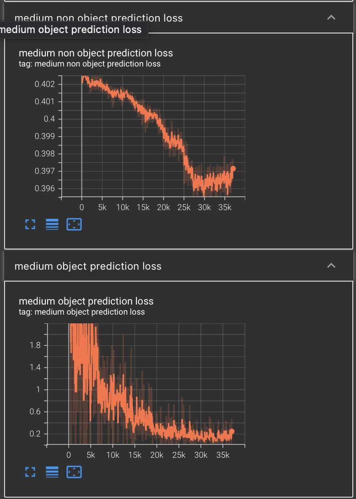
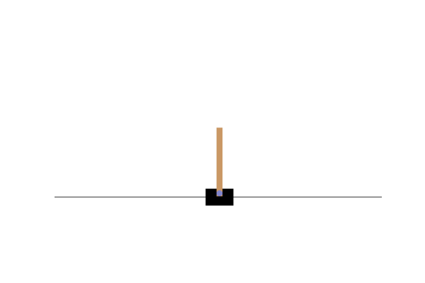
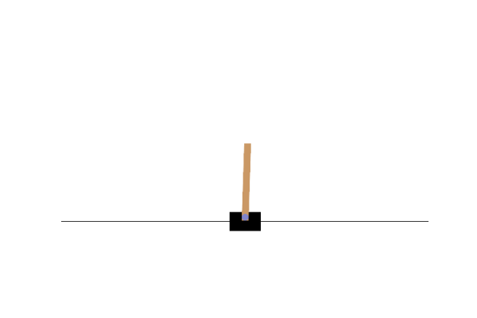

# Face recognition and face detection project
Purpose: to detect whether there is a face of a person in an image, and to classify the face if it is appear on the dataset. The decrease in the loss function. However, the accuracy do not improve greatly.

The result is shown here

## Medium Metrics

# First reinforcement learning project

# Expert 
this is the demonstation of expert

# Behavior cloning
This is the demonstation of an agent for behavior cloning

# Generative Adversial Imitation learning
This is the demonstation of an agent for GAIL

